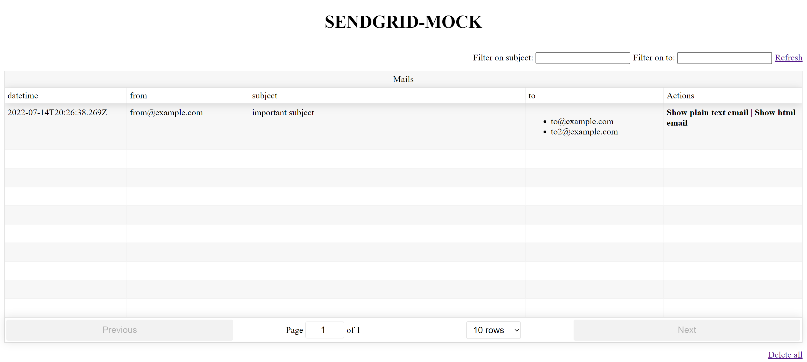

# SendGrid-Mock

SendGrid-Mock serves as a simple server mocking the sendgrid-apis for development purposes.



## Functionalities

### HTTP API

* Send mails `POST /v3/mail/send`

* Retrieve sent mails `GET /api/mails`
  * Filter capabilities are included and can be combined:
    * **To**: `GET /api/mails?to=email@address.com`
    * **Subject**:
      * `GET /api/mails?subject=The subject` (*exact match*)
      * `GET /api/mails?subject=%subject%` (*contains*)
    * **Datetime**: `GET /api/mails?dateTimeSince=2020-12-06T10:00:00Z` (*[ISO-8601 format](https://en.wikipedia.org/wiki/ISO_8601)*)

* Delete sent mails `DELETE /api/mails`
  * Filter capabilities are included and can be combined:
    * **To**: `DELETE /api/mails?to=email@address.com`

### UI

* Retrieve sent mails and display them
* Delete sent mails

### Extras

* Basic authentication support: Add basic authentication credentials by specifying environment variable `AUTHENTICATION` to the following format: `user1:passwordForUser1;user2:passwordForUser2`

* Request rate limiting: Both the actual SendGrid API server as well as the SSL server can be rate limited by specifying environment variables:
  * `RATE_LIMIT_ENABLED`: `true` or `false` (default)
  * `RATE_LIMIT_WINDOW_IN_MS`: The time window in milliseconds (default: `60000`)
  * `RATE_LIMIT_MAX_REQUESTS`: The maximum number of requests allowed in the time window (default: `100`)
  * `SSL_RATE_LIMIT_ENABLED`: `true` or `false` (default)
  * `SSL_RATE_LIMIT_WINDOW_IN_MS`: The time window in milliseconds (default: `60000`)
  * `SSL_RATE_LIMIT_MAX_REQUESTS`: The maximum number of requests allowed in the time window (default: `100`)

* By default, all emails older than 24 hours will be deleted. This can be configured using environment variable `MAIL_HISTORY_DURATION` which uses [ISO-8601 Duration format](https://en.wikipedia.org/wiki/ISO_8601#Durations) such as *'PT24H'*.

## Dockerized

The SendGrid-Mock server and the UI are both contained in the same docker-image which you can pull from [Docker Hub](https://cloud.docker.com/u/ghashange/repository/docker/ghashange/sendgrid-mock) and start it via:

```shell
docker run -it -p 3000:3000 -e "API_KEY=sendgrid-api-key" ghashange/sendgrid-mock:1.9.2
```

Some prepared HTTP calls can be found [here](./http-calls).

The UI can be accessed at <http://localhost:3000>.

### SSL support

SendGrid-Mock also supports SSL using [Let's Encrypt](https://letsencrypt.org/). To enable SSL, run it as follows:

```shell
docker run -it -p 3000:3000 -e "API_KEY=sendgrid-api-key" -e "CERT_DOMAINNAMES=[your-domain-name]" -e "CERT_EMAIL=[your-email-address]" ghashange/sendgrid-mock:1.9.2
```

## Development

Setup with `npm ci` and start both server and UI concurrently with `npm run dev`. Per default the server is reachable via <http://localhost:3000> and the UI via <http://localhost:1234>.

Some prepared HTTP calls can be found [here](./http-calls).

The UI can be accessed at <http://localhost:3000>.

### Build

Create docker image with `docker build -t ghashange/sendgrid-mock:1.9.2 .`.

### Release

1. Update version number in [package.json](./package.json), [version file](./version) and [README](./README.md)

2. Create PR against **master** branch

3. Merge PR

4. Create GitHub release and update [Docker Hub description](https://hub.docker.com/repository/docker/ghashange/sendgrid-mock)
